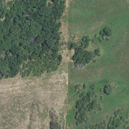
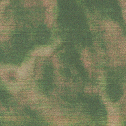
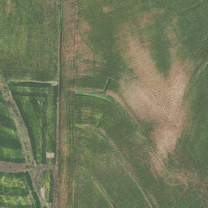
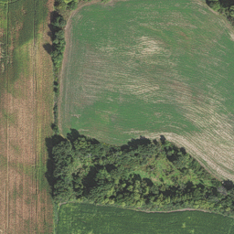
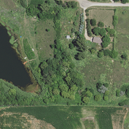
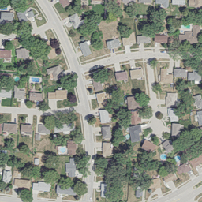

# aerial_imagery_gan

A GAN for aerial imagery

```bash
sudo docker build ~/aerial_imagery_gan --tag=aerial_imagery_gan
sudo docker run --gpus all -it -v ~/aerial_imagery_gan:/home/aerial_imagery_gan aerial_imagery_gan bash
python src/fit_gan.py
```

Real NAIP image patches look like this:













The generated images are not yet convincing.
The most realistic ones I've seen so far look vaguely like forest or pasture with bushes:


TODO Have a look at the tips in https://arxiv.org/abs/1606.03498