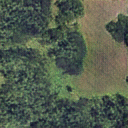
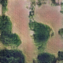
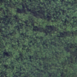
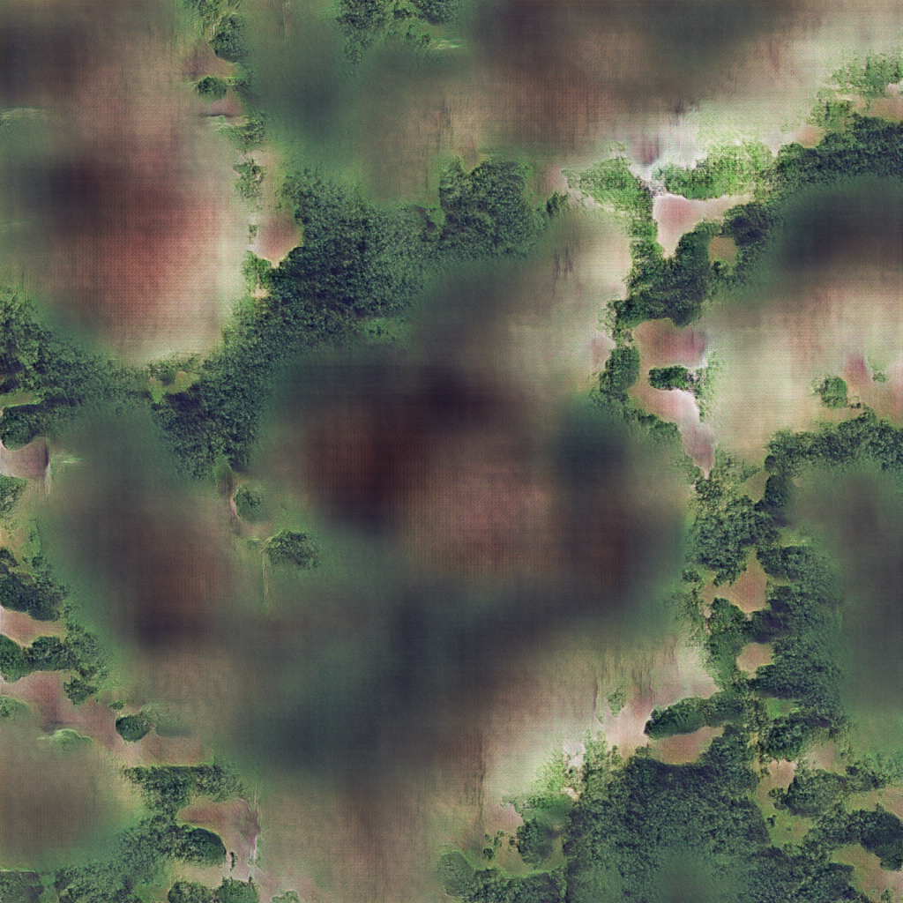

# aerial_imagery_gan

A GAN for aerial imagery

The inputs to the model are
[National Agriculture Imagery Program](https://www.fsa.usda.gov/programs-and-services/aerial-photography/imagery-programs/naip-imagery/)
(NAIP) scenes. These are four band (R G B NIR) aerial imagery rasters downloaded from [USGS Earth Explorer](https://earthexplorer.usgs.gov/)
and placed in the `./naip` directory.

```bash
sudo docker build ~/aerial_imagery_gan --tag=aerial_imagery_gan
sudo docker run --gpus all -it -v ~/aerial_imagery_gan:/home/aerial_imagery_gan aerial_imagery_gan bash
python src/fit_gan.py
```

Real NAIP image patches look like this:


The generator output (shown here for a fixed epoch, with varying input noise)
looks like this:







Since the generator is fully convolutional, we can also use it to generate
images larger than the patches it was trained on, like this:

